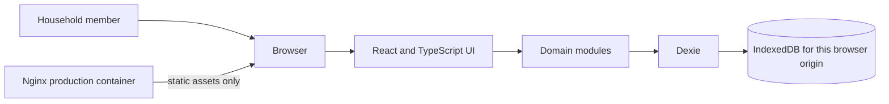

# Architecture

## System Boundary

Commonplace is a browser-only finance application. The production Nginx container serves static HTML, JavaScript, CSS, and font assets; it does not receive or persist household records. There is no application API, account service, cloud sync, analytics endpoint, or server-side household database.

The browser origin is the storage boundary. `http://localhost:5173` and `http://localhost:8081` use separate IndexedDB databases, even in the same browser profile. Export/import a backup to move data between origins or devices.

## Runtime and Modules

- `src/main.tsx` loads fonts and styles and mounts the React application.
- `src/App.tsx` owns navigation, selected month, form state, filtered lists, and refreshes after database changes.
- `src/domain/types.ts` defines members, expenses, categories, summaries, and backup contracts.
- `src/domain/database.ts` is the Dexie adapter and transaction boundary.
- `src/domain/finance.ts` calculates income weights, cent allocations, summaries, trends, and date filters.
- `src/domain/backup.ts` validates the versioned JSON format and defines merge behavior.
- `src/domain/reports.ts` creates CSV downloads and a lazily loaded jsPDF report.
- `src/domain/format.ts` formats dates/currency and validates monetary input.

React state is the in-memory view of the ledger. IndexedDB is the persistent source of truth. The app reads both stores at startup and refreshes them after a successful write. No state-management server or cross-device synchronization is configured.

## Local Data Model

Dexie database: `commonplace-household`, schema version 1.

| Store | Primary key | Indexed fields |
| --- | --- | --- |
| `members` | `id` | `name` |
| `expenses` | `id` | `date`, `type`, `category`, `memberId` |

Amounts are integer cents. A `Member` has an ID, name, monthly income, display color, and creation timestamp. An `Expense` has an ID, description, amount, category, type, owner ID for a personal purchase (or `null` for shared), calendar date, and creation timestamp. Categories are Groceries, Housing, Utilities, Transport, Health, Leisure, Savings, and Other.

Member deletion runs in a read/write transaction across both stores. It deletes that member's personal expenses and the member record together; shared expenses remain. Backup replace and merge operations also use a transaction across both stores.

## Shared Expense Allocation

For member $i$, monthly income is $s_i$ cents and the household total is $S = \sum_i s_i$. If $S > 0$, the weight is:

$$w_i = \frac{s_i}{S}$$

If all incomes are zero, weights are equal. For a shared expense of $C$ cents, the implementation first assigns $\lfloor Cw_i \rfloor$ to each member. It then distributes leftover cents by descending fractional remainder, breaking ties by the member's original list order. Therefore, all member shares sum exactly to $C$ and repeated calculations are deterministic.

Summaries apply the current member incomes to each shared expense in the requested period. They add a member's personal purchases only to that member and calculate remaining income as monthly income minus total spending. Editing an income therefore recalculates the selected period using the updated weights; the app does not preserve historical income snapshots.

## Reports and Backups

Report date ranges are inclusive. The selected category and date range are applied to the same expense set for both CSV and PDF. CSV output includes a UTF-8 BOM, quoted cells, and spreadsheet-formula prefix neutralization for untrusted text. PDF generation imports jsPDF only when requested and includes member summaries, a vector contribution bar chart, and itemized expenses.

A backup has `format: "commonplace-backup"`, `version: 1`, `exportedAt`, `members`, and `expenses`. Restore validates JSON, record fields, unique IDs, category values, real calendar dates, and personal-expense owner references before any database write. Files over 10 MiB are rejected. Replace clears and writes both stores atomically. Merge uses IDs: imported records replace records with the same ID, while unmatched local records remain.

## Security and Privacy

- Household content remains in browser-managed IndexedDB; the application does not encrypt it itself.
- Anyone with access to the same browser profile and origin can access its ledger.
- Browser site-data deletion can permanently remove the records. Keep an external JSON backup.
- The production Nginx config adds a Content Security Policy and common response-security headers. It serves immutable cached assets and a non-cached SPA entry point.
- This local-first design has no user authentication, authorization, or remote backup. It is intended for a trusted browser/device, not a shared public kiosk.

## Quality Checks

Vitest covers financial arithmetic, formatting, range filtering, backup validation, CSV/PDF exports, Dexie transactions, and UI workflows. Component tests use Testing Library and fake IndexedDB. TypeScript is strict; ESLint and a production Vite build run through the Docker test service. See [Installation and Operations](guia-instalacion.md) for commands.